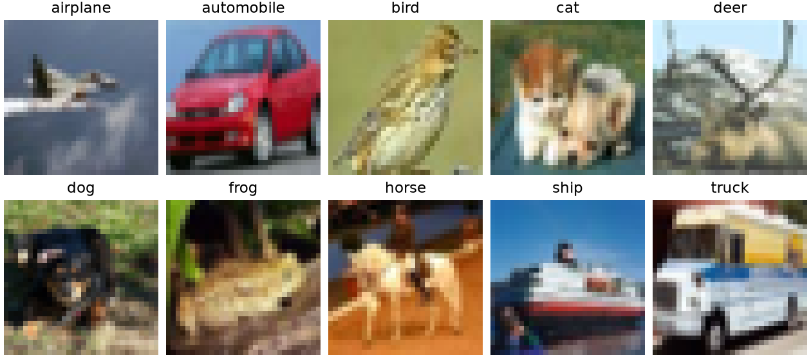
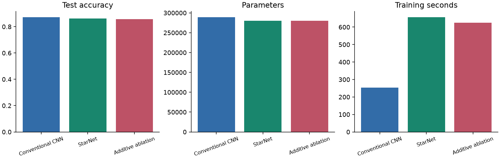
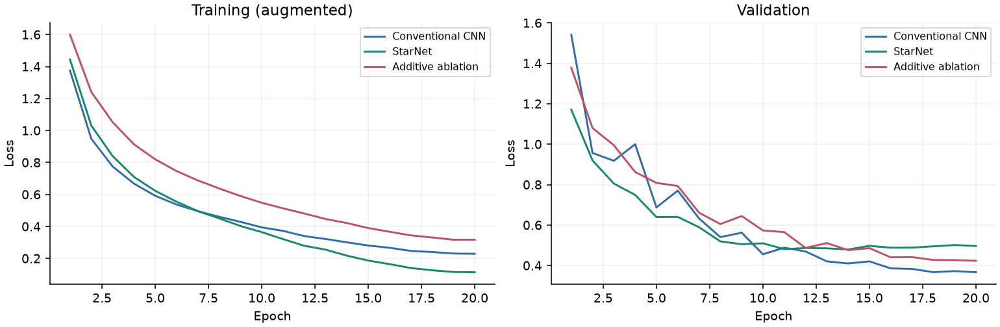
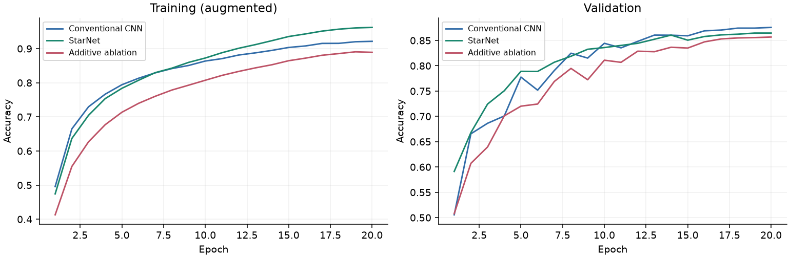
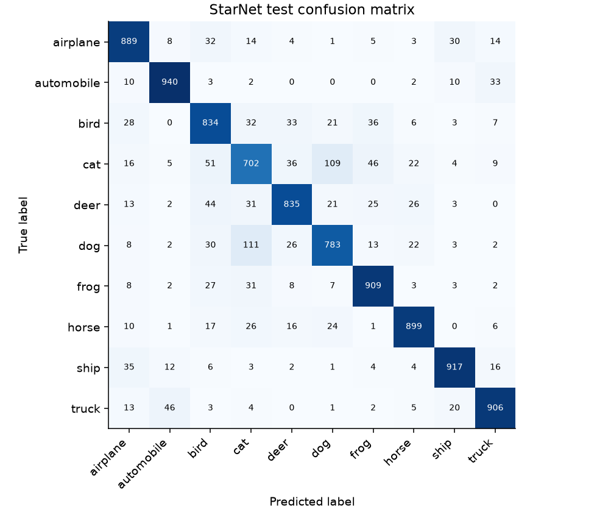
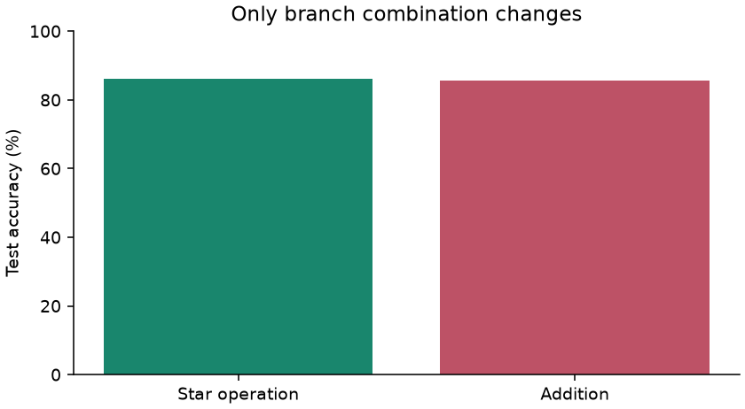
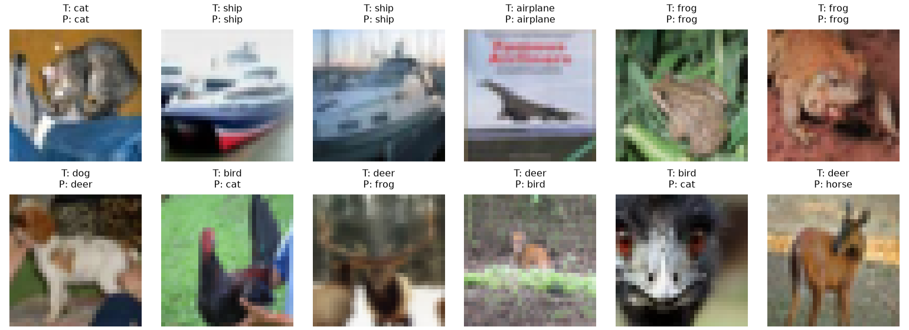

# StarNet for CIFAR-10 Image Classification

CISC3024 Pattern Recognition | AI Assignment 1 | September 2026

This project adapts the CVPR 2024 StarNet CNN to small-image classification. After 20 epochs, StarNet achieved 86.14% test accuracy, compared with 87.22% for a conventional CNN and 85.60% for the additive ablation. These are actual local results, not reproductions of the paper's ImageNet results.

## 1 How I asked AI to find the algorithm

### Actual prompts and approval sequence

I first asked Codex to research the assignment before implementing anything. These are verbatim excerpts from my initial message:

> Read `requirement.txt` completely.
> Do not modify any files or write any code yet.
> First inspect the workspace and available computing resources, then research several recent Deep CNN / Deep Autoencoder algorithms that satisfy the assignment.

> Do not start implementation until I approve the algorithm and project plan.

I requested original papers, publication years, assignment eligibility, applications, datasets, difficulty, computing requirements and a justified recommendation. When inspection was interrupted, my actual follow-up was:

> keep searching

After receiving the comparison, I explicitly approved the proposal:

> I approve the project plan:
>
> **Algorithm: StarNet (Rewrite the Stars, CVPR 2024)**
> **Application: CIFAR-10 image classification**

The same approval message requested the complete assignment, including experiments, a data-driven website and the report. It also stated:

> Please do not fabricate any results. All reported numbers, tables, and figures must come from actual executed experiments.

Thus, research preceded approval and implementation. Existing implementation-stage notes separately record `read requirement_2.txt and execute it`; that record does not replace this earlier selection dialogue. This revision corrects the previous report's statement that no earlier search conversation was available.

### Actual research process

Codex read all thirteen sections of `requirement.txt` through TextEdit and inspected the workspace through Finder. The visible folder then contained only `requirement.txt`. System Settings identified an Apple M5 MacBook Pro, 16 GB unified memory, macOS 26.6.2 and approximately 851 GB free storage. ML package availability and actual MPS execution were not established during this initial inspection; the later measured environment appears in section 4.

The actual Google search query was `FasterNet Run Don't Walk CVPR 2023 StarNet 2024 convolutional network`. Codex then directly opened the FasterNet arXiv record, CVF publication pages for StarNet, ConvNeXt V2 and DRAEM, the official StarNet repository, and official CIFAR and MVTec AD dataset pages. These direct source visits are not presented as additional search-engine queries. The implementation-stage notes additionally document ConvNeXt research and inspection of the official StarNet block. Questions about model category, spatial downsampling and local feasibility describe the reasoning process, not invented verbatim student prompts.

| Candidate and primary paper | Year and eligibility | Application and datasets | Difficulty and local feasibility |
| --- | --- | --- | --- |
| StarNet, *Rewrite the Stars* [1] | CVPR 2024; deep CNN | Object classification; CIFAR-10/CIFAR-100 | Moderate; compact convolutional blocks with multiplicative branches and a direct operator ablation. |
| FasterNet, *Run, Don't Walk* [3] | CVPR 2023; deep CNN | Efficient recognition; CIFAR-10/CIFAR-100 | Moderate; partial convolution reduces redundant work, but channel slicing and hardware-dependent latency need care. |
| ConvNeXt V2, *Co-Designing and Scaling ConvNets With Masked Autoencoders* [5] | CVPR 2023; deep CNN with convolutional masked-autoencoder pretraining | Classification and representation learning; reduced-scale CIFAR experiments | High for the complete recipe; masked pretraining, Global Response Normalization and downstream training enlarge the scope. |
| DRAEM, *A Discriminatively Trained Reconstruction Embedding for Surface Anomaly Detection* [6] | ICCV 2021; deep reconstruction/autoencoder and discriminative networks | Industrial defect detection/localization; MVTec AD [7] | Moderate to high; synthetic anomaly generation, reconstruction and pixel-level evaluation on larger images. Older, but within the 2020s criterion. |
| ConvNeXt, *A ConvNet for the 2020s* [2] | CVPR 2022; deep CNN, recorded in the implementation-stage comparison | Classification; CIFAR-10/CIFAR-100 | Moderate; modern convolutional architecture requiring downscaling. Distinct from ConvNeXt V2. |

The initial response also mentioned a generic compact convolutional autoencoder, but without a specific recent paper it was not a fully qualified candidate. The table retains identifiable published methods. Cost comparisons are qualitative assessments, not local benchmarks of these families.

### Selection rationale

StarNet was recommended before my approval because it combines an authoritative recent paper, an unambiguous CNN architecture, an official implementation and a focused ablation question. Its 2024 publication satisfies the assignment's 2020s criterion; it is not claimed to be the newest model in 2026 or universally the best model. Compact standard-layer implementations are appropriate for the M5/16 GB budget.

CIFAR-10 [4] offers 60,000 public 32x32 RGB images, ten classes, a standard 50,000/10,000 train/test split and an approximately 163 MB Python archive. It permits training from scratch and reproducible classification evaluation. CIFAR-100 would increase task difficulty, while MVTec AD suits DRAEM but adds localization and data-handling complexity. Full ImageNet training was outside the intended local scope. I approved the proposed 45,000/5,000/10,000 split, comparable CNN baseline, star-operation ablation, learning curves, confusion matrix and timing analysis. Primary sources are listed in section 6; the conversation establishes the initial selection history, while `docs/research.md` records the implementation-stage research.

## 2 Algorithm description

StarNet was introduced by Xu Ma, Xiyang Dai, Yue Bai, Yizhou Wang and Yun Fu in Rewrite the Stars, CVPR 2024 [1]. It studies whether element-wise multiplication of learned feature projections can improve representational capacity in compact networks. The model remains a deep CNN: spatial mixing uses learned convolutions, channel mixing uses pointwise convolutions, and multiple convolutional blocks form a hierarchy. It is neither a Vision Transformer nor an autoencoder.

### Star operation and data flow

For block input x, let z = BN(DWConv7x7(x)). Two pointwise convolutions produce a = W1 z + b1 and b = W2 z + b2, each with three times the input channels in this adaptation. The block computes h = ReLU6(a) * b, where * is element-wise multiplication. It projects h back to the original width, applies batch normalization and a second 7x7 depthwise convolution, then adds the residual input x. Thus the block preserves spatial dimensions and channel count.

Ignoring bias and activation for illustration, (w1^T z)(w2^T z) = sum_i sum_j w1_i w2_j z_i z_j. This exposes pairwise feature interactions without explicitly storing every quadratic feature. The paper relates this to implicit feature spaces in kernel methods. The practical network contains ReLU6, normalization and residual connections, so this equation is an intuition rather than a literal kernel algorithm or a guarantee of better accuracy. The learned coefficients are constrained by the two projections; they are not independently free for every product term.

| Component | Original main StarNet family | CIFAR-10 adaptation |
| --- | --- | --- |
| Input and output | ImageNet images and 1000 classes | 32 x 32 RGB and 10 classes |
| Stem | 3x3 convolution, stride 2, 32 channels | 3x3 convolution, stride 1, 24 channels |
| Stages | Four stages, widths double | Three stages: 24 / 48 / 96 |
| Depth and stride | Variant-dependent depth; stride 2 per stage | Depth 1 / 1 / 2; stride 1 / 2 / 2 |
| Branch expansion | 4 in main paper variants | 3, also used by some official small variants |
| Head | Batch norm, global average, classifier | Same structure with 10 outputs |
| Training | Original ImageNet recipe | Local budget; no pretrained weights |

The adaptation keeps 32x32, 16x16 and 8x8 stage outputs, avoiding excessive downsampling of small images. It uses no stochastic depth. PyTorch default convolution and linear initialization is used; no exact original initialization or training recipe is claimed. The objective is mean ten-class cross-entropy, L = -(1/N) sum_i log softmax(f(x_i))[y_i].

The baseline has two 3x3 Conv-BN-ReLU layers per stage, widths 32/64/128, 2x2 max pooling after each stage, global average pooling and a linear head. The ablation retains every StarNet layer and changes only ReLU6(a) * b to ReLU6(a) + b. The two StarNet variants therefore have exactly the same number of parameters.

## 3 How AI implements the algorithm

Codex assisted with research, design, coding, command execution, debugging, experiments, visualization and report preparation. My role was to specify requirements, assess the recommendation, approve StarNet/CIFAR-10 and request the complete assignment. Implementation-stage notes additionally record the supplied GitHub destination. I did not manually write the project code. Research and approval are supported by this conversation; the execution account below is supported by the existing project artifacts and verification records.

The first implementation attempt in this conversation stopped because usable file-editing and command-execution tools were unavailable. That attempt produced no project files or experiments. The later project artifacts now present in the workspace provide the evidence for the completed runs below; they must not be attributed to the earlier blocked attempt. This report revision inspected saved results and source files rather than rerunning training.

### From paper to executable pipeline

According to the implementation-stage records, that phase began with requirement.txt and requirement_2.txt. This is a later workspace state than the initial one-file research inspection. Those records describe checks of Python packages, storage and hardware: system Python lacked the ML stack, Anaconda provided PyTorch and torchvision, and MPS became available outside the sandbox. The saved execution environment identifies MPS as the training device. The approved three-model protocol was implemented before full training.

src/models.py expresses the official StarNet block using standard PyTorch layers, with a single operation selector for multiplication or addition. src/data.py downloads CIFAR-10, creates the seeded stratified split, measures training-only normalization, and creates augmented training and deterministic evaluation datasets. src/train.py constructs the optimizer and scheduler, runs epochs, writes histories atomically, saves the best validation checkpoint, reloads it, and evaluates the official test set.

scripts/analyze.py turns saved predictions and histories into figures, CSV summaries and dashboard JSON. website/ loads that JSON and generated images; its controls switch metrics, models and prediction outcomes. scripts/verify.py reconstructs confusion matrices and accuracy, checks disjoint split indices and parameter structures, reloads checkpoints on CPU and checks finite forward outputs. The original report was generated by scripts/report.py from these results. This Markdown revision additionally incorporates the earlier conversation. The existing report_content.json and Word/PDF files describe the earlier report version and have not been regenerated in this revision; running scripts/report.py would overwrite these editorial changes.

### Website and evidence traceability

The website is a local interactive dashboard served from the project root. Its experiment displays load `artifacts/results/dashboard.json` and generated images; architecture and dataset descriptions explain the experimental context. Model and metric controls expose comparisons and curves, while prediction filters distinguish correct from incorrect examples. The website presents saved experiments rather than launching new training. Timing values retain the measurement definitions in section 4.

| Report or website content | Saved evidence |
| --- | --- |
| Accuracy, loss, parameter count and timing | `artifacts/results/*_results.json` and `experiment_summary.csv` |
| Training and validation curves | `artifacts/results/*_history.json` |
| Confusion matrices and prediction examples | `artifacts/results/*_predictions.json` and generated figures |
| Protocol and environment | `configs/full.json`, `artifacts/results/config.json`, `split.json` and `environment.json` |
| Metric/checkpoint and controlled-ablation checks | `artifacts/results/verification.json` and `protocol_checks.json` |
| Recorded website checks | `artifacts/results/website_http_checks.json` and `website_ui_checks.json` |

The saved verification records report successful metric reconstruction, checkpoint checks, split checks and website checks. They are evidence of prior verification, not claims that browser or training checks were rerun while editing this Markdown file.

### Pilot verification and corrections

The mandatory pilot used 2048 training, 512 validation and 512 test examples for two epochs per model. It exercised downloading, transforms, loaders, forward and backward passes, loss, optimization, validation, saving and loading, evaluation, logging and figure generation. The corrected pilot had decreasing training losses and validation accuracy above chance. Combined model training took about nine seconds, excluding preparation and the roughly five-minute dataset download. Pilot results are kept separate under artifacts/pilot and are not used as final results.

The pilot test subset comprises the first 512 official test images. This is limited test-set exposure for pipeline verification, disclosed here rather than calling the complete test set entirely unseen. Pilot test scores were not used for accuracy tuning, checkpoint selection or selecting the full training budget.

Concrete corrections were made before full training. A guessed official source path returned 404; the GitHub tree located imagenet/starnet.py. Normalization reductions were changed to float64 accumulation for numerical accuracy. The initial baseline was widened to match StarNet's parameter budget; the revised baseline pilot was rerun. A writable plotting cache resolved font-cache warnings. The final pilot passed independent verification and produced eleven figures before full training began.

The implementation intentionally avoids extra training techniques that would complicate the operator comparison. It uses neither pretrained weights, mixup, distillation nor model-specific tuning. Fixed seeds improve repeatability, but MPS execution is not promised to be bitwise deterministic. Checkpoint hashes and training-source hashes provide provenance for the actual saved runs.

## 4 Experiment settings and results

### Experiment settings

CIFAR-10 [4] is a public image classification dataset with 60000 color images, ten mutually exclusive classes and 32x32 resolution. The official training set contains 50000 images; 500 per class were held out for validation, leaving 4500 per class for training. The official 10000-image test set has 1000 images per class. No validation or test examples contribute to gradient updates or normalization statistics.

| Setting | Actual value |
| --- | --- |
| Split and seed | 45000 train / 5000 validation / 10000 test; seed 3024 |
| Input and augmentation | 32x32 RGB; 4-pixel padding, random crop, horizontal flip for training only |
| Normalization mean | 0.491045, 0.481686, 0.445724 |
| Normalization standard deviation | 0.247093, 0.243491, 0.261444 |
| Hardware | Apple M5; 16 GiB unified memory; MPS |
| Operating system | macOS-26.6.2-arm64-arm-64bit-Mach-O |
| Software | Python 3.14.6; PyTorch 2.14.0; torchvision 0.29.0; NumPy 2.4.6 |
| Optimizer | AdamW, initial lr 0.003, weight decay 0.0005; betas 0.9/0.999, eps 1e-8 |
| Schedule and budget | CosineAnnealingLR to zero after 20 epochs; no warmup; batch 128; no early stopping |
| Loss and precision | Mean cross-entropy; float32; no label smoothing |
| Checkpoint selection | Highest validation accuracy; earliest epoch on ties |
| Evaluation | Reload selected checkpoint; eval mode; no gradients or test augmentation |
| Randomness | Python, NumPy, PyTorch, MPS and loader seeds fixed; zero loader workers |

*Figure 1. One actual training example per class from the saved training split.*

### Classification results and computational cost

| Model | Test accuracy | Test loss | Best val. | Selected epoch |
| --- | --- | --- | --- | --- |
| Conventional CNN | 87.22% | 0.3875 | 87.58% | 20 |
| StarNet | 86.14% | 0.5098 | 86.46% | 19 |
| Additive ablation | 85.60% | 0.4340 | 85.68% | 20 |

| Model | Parameters | Conv/linear MACs | Train min | ms / image |
| --- | --- | --- | --- | --- |
| Conventional CNN | 289,194 | 38.63 M | 4.22 | 0.0570 |
| StarNet | 280,522 | 37.33 M | 10.95 | 0.1223 |
| Additive ablation | 280,522 | 37.33 M | 10.43 | 0.1237 |

Table values come from artifacts/results/*_results.json and experiment_summary.csv. Training time includes validation and checkpoint writing, but excludes downloading, data preparation and final testing. Inference uses device-resident zero-input batches, ten warmups and thirty synchronized measurements. The table reports median batch time divided by batch size; this is amortized throughput cost, not batch-one latency. Transfer and preprocessing are excluded. Unfused eager PyTorch execution on MPS is not comparable to the paper's ONNX/CoreML deployment benchmarks.

MACs count convolution and linear multiply-accumulates for one 32x32 image. They exclude biases, normalization, activation, pooling and element-wise branch operators. This partial operation count is reported instead of an unsupported total FLOPs claim. Equal MAC counts for StarNet and ablation reflect the counting convention, not an assertion that their executed instructions are identical.

Saved checkpoint sizes: Conventional CNN 1.121 MiB; StarNet 1.111 MiB; Additive ablation 1.112 MiB. These serialized files contain model state and metadata, not optimizer state. The baseline has 3.09% more parameters than StarNet; the capacity comparison is close, but receptive fields and optimization differ.

*Figure 2. Actual test accuracy, capacity and measured training duration.*

StarNet differs from the baseline by -1.08 percentage points in test accuracy. The comparison describes these specific architectures under a shared budget; it does not isolate the star operator. The additive ablation provides the more controlled operator comparison.

### Learning curves

*Figure 3. Training and validation cross-entropy, generated from each saved epoch history.*

*Figure 4. Training and validation accuracy for the same runs.*

Training metrics average predictions on augmented batches while parameters change within the epoch. Validation is measured afterward in evaluation mode without augmentation. These curves therefore should not be interpreted as measurements on identically distributed inputs. Validation fluctuations can occur with batch-normalization statistics and the initial learning rate; checkpoint selection prevents the final epoch from being chosen merely because it is last.

At the final epoch, Conventional CNN has training accuracy 92.15% and validation accuracy 87.58%; StarNet has training accuracy 96.23% and validation accuracy 86.46%; Additive ablation has training accuracy 88.92% and validation accuracy 85.68%. The budget was fixed before full training. There was no test-guided extension of training and no claim that the models reached their best attainable accuracy.

StarNet's final training-minus-validation accuracy gap is 9.77 percentage points, compared with 4.57 for the baseline. A larger gap together with lower held-out accuracy is consistent with stronger fitting of the training set without better generalization. The differing train/evaluation conditions above prevent interpreting this gap as a pure measure of overfitting, and no causal diagnosis is established.

### Confusion matrix and class errors

*Figure 5. StarNet official-test confusion matrix. Rows are true labels; columns are predictions.*

The largest off-diagonal counts are dog predicted as cat: 111; cat predicted as dog: 109; cat predicted as bird: 51. These are observed label confusions, not evidence that a particular visual mechanism caused each error. Small image resolution and similarities between classes are plausible contributing factors, but would require further analysis to establish.

StarNet recall ranges from 70.20% for cat to 94.00% for automobile. Each class has 1000 test images, so overall accuracy also equals macro-averaged recall here. Full confusion matrices and class recall for all models are available in the result files and website.

### Ablation and representative predictions

*Figure 6. Multiplication versus addition with identical StarNet parameter structure.*

StarNet achieves 86.14% versus 85.60% for addition, a signed difference of +0.54 percentage points. This run supports a benefit from the star operation under the selected protocol. Widths, depths, branches, initialization seed, split, augmentation, optimizer and epoch budget are fixed. Addition changes activation scale as well as removing multiplicative interactions, so the result includes resulting optimization effects. One seed cannot establish statistical significance or universal superiority.

*Figure 7. First six correct and first six incorrect StarNet predictions in official test order. T is true label; P is predicted label.*

The example selection is deterministic and disclosed; it is not a random estimate of error prevalence. All test predictions, true labels and maximum softmax probabilities are saved. The website permits switching models and filtering correct or incorrect examples. Softmax confidence has not been calibrated and must not be treated as a guaranteed probability of correctness.

## 5 What I have learnt from this AI assignment

This reflection is written with AI assistance from the documented project evidence. It describes the technical lessons of this assignment; it does not claim that I manually coded the models or personally ran commands that Codex executed.

I learned to make algorithm-search requests testable. A recent publication date alone does not establish that a method is a deep CNN, and a familiar name is not evidence of local feasibility. Checking the primary paper and official implementation established both the convolutional structure and the role of element-wise multiplication. Comparing FasterNet, ConvNeXt V2 and DRAEM during selection, with ConvNeXt considered in the implementation notes, clarified that complexity and a clear ablation question matter for a limited student project. Preserving my original research request and explicit approval is more reliable than reconstructing a conversation afterward.

I also learned to distinguish an AI's intended actions from completed work. The initial tool-limited attempt did not create an implementation, despite progress messages describing intended next steps. The results in this report require saved experiment evidence. Likewise, the earlier draft's statement that no search conversation was available had to be corrected when this session was incorporated. Checking provenance is part of evaluating AI-generated documentation.

I learned that the star operation is more specific than just using a nonlinear activation. Multiplying two learned projections introduces products between feature coordinates. Depthwise convolutions mix spatial information within channels, while pointwise convolutions mix channels. The residual path retains the input and makes stacking blocks practical. These distinctions make it easier to read a block diagram and verify that generated code implements the intended computation.

I also learned why a dataset adaptation must be stated precisely. Reusing an ImageNet downsampling pattern on 32x32 images would quickly discard spatial resolution. The stride-1 stem, fewer stages and smaller classifier are practical changes, but they mean this project is not an exact paper reproduction. Likewise, parameter matching makes the baseline comparison more informative without making the networks identical in compute, receptive field or optimization difficulty.

The controlled operator comparison gave a +0.54-percentage-point test difference for multiplication relative to addition. I learned to separate that observation from a claim about all networks. A theoretical argument for richer features does not determine accuracy on every dataset or training budget. Changing one operation can also change feature scale and optimization, so an ablation needs a precise statement of both what is fixed and what follows from the change.

The pilot showed me why AI-generated code needs execution-based checks. The first environment check did not expose the GPU, a guessed upstream path was wrong, and the initial baseline was too small for the intended comparison. These were resolved through hardware checks, repository inspection, numerical review and rerunning the pilot. Saving checkpoints was not enough: loading them again, checking finite outputs and reconstructing metrics made the evidence stronger.

I learned to keep validation and test roles separate. Validation selected the checkpoint; the official test set was evaluated after training and did not select the budget. A reproducible study also needs split indices, preprocessing statistics, seeds, software versions and timing definitions. My main remaining scientific limitations are the single seed, short training budget, one dataset and uncalibrated confidence. Multiple seeds and longer fixed-budget comparisons would be the next experiments, not grounds for overstating the present results.

## 6 Webpage link of source codes

The assignment source-code repository webpage supplied by the student is:

[https://github.com/yuannnnn1/StarNet](https://github.com/yuannnnn1/StarNet)

The webpage was reachable during preparation. Publishing this local implementation was deferred by the student; this report does not claim that the remote repository already contains these experiment artifacts. The local project contains the complete implementation and reproduction instructions. The official paper repository cited below is a separate upstream source.

### Repository structure and reproduction

src/ contains model, data and train/evaluate modules; configs/ contains pilot and full protocols; scripts/ contains analysis, verification and report generation; website/ contains the dashboard; docs/ records research and checks. artifacts/results/ stores machine-readable metrics and per-image predictions, artifacts/figures/ stores plots, artifacts/checkpoints/ stores local model states, and artifacts/report/ contains this report. Large datasets, environments and checkpoints are excluded from Git.

Install the Python dependencies in requirements.txt in a virtual environment. The measured environment is documented in section 4 and artifacts/results/environment.json. Run python -m src.train --config configs/pilot.json for the pilot, then python -m scripts.analyze --root artifacts/pilot and python -m scripts.verify --root artifacts/pilot. For full experiments run python -m src.train --config configs/full.json. To evaluate saved checkpoints run python -m src.train --config configs/full.json --evaluate-only. Run python -m scripts.analyze and python -m scripts.verify for figures and consistency checks.

Serve the project root with python -m http.server 8000 --bind 127.0.0.1 and open http://127.0.0.1:8000/website/. Generate the Word report with python -m scripts.report. README.md gives the complete setup and rendering procedure. CIFAR-10 downloads from its official source through torchvision and is not redistributed in the repository. Checkpoint files can be regenerated by training; they are retained locally for evaluation.

### References

[1] Xu Ma, Xiyang Dai, Yue Bai, Yizhou Wang and Yun Fu. Rewrite the Stars. Proceedings of the IEEE/CVF Conference on Computer Vision and Pattern Recognition, 2024, pp. 5694-5703.

[CVPR 2024 primary paper](https://openaccess.thecvf.com/content/CVPR2024/html/Ma_Rewrite_the_Stars_CVPR_2024_paper.html)

[Official implementation at commit c999eb5](https://github.com/ma-xu/Rewrite-the-Stars/tree/c999eb50840a44f9f1d92e8f7d2c22cd645a6d5e)

[2] Zhuang Liu, Hanzi Mao, Chao-Yuan Wu, Christoph Feichtenhofer, Trevor Darrell and Saining Xie. A ConvNet for the 2020s. CVPR, 2022, pp. 11976-11986.

[ConvNeXt primary paper](https://openaccess.thecvf.com/content/CVPR2022/html/Liu_A_ConvNet_for_the_2020s_CVPR_2022_paper.html)

[3] Jierun Chen, Shiu-hong Kao, Hao He, Weipeng Zhuo, Song Wen, Chul-Ho Lee and S.-H. Gary Chan. Run, Don't Walk: Chasing Higher FLOPS for Faster Neural Networks. CVPR, 2023, pp. 12021-12031.

[FasterNet primary paper](https://openaccess.thecvf.com/content/CVPR2023/html/Chen_Run_Dont_Walk_Chasing_Higher_FLOPS_for_Faster_Neural_Networks_CVPR_2023_paper.html)

[4] Alex Krizhevsky. Learning Multiple Layers of Features from Tiny Images. Technical report, University of Toronto, 2009. Dataset creators: Alex Krizhevsky, Vinod Nair and Geoffrey Hinton.

[Official CIFAR-10 dataset and report](https://www.cs.toronto.edu/~kriz/cifar.html)

[5] Sanghyun Woo, Shoubhik Debnath, Ronghang Hu, Xinlei Chen, Zhuang Liu, In So Kweon and Saining Xie. ConvNeXt V2: Co-Designing and Scaling ConvNets With Masked Autoencoders. CVPR, 2023, pp. 16133-16142.

[ConvNeXt V2 primary paper](https://openaccess.thecvf.com/content/CVPR2023/html/Woo_ConvNeXt_V2_Co-Designing_and_Scaling_ConvNets_With_Masked_Autoencoders_CVPR_2023_paper.html)

[6] Vitjan Zavrtanik, Matej Kristan and Danijel Skocaj. DRAEM: A Discriminatively Trained Reconstruction Embedding for Surface Anomaly Detection. ICCV, 2021, pp. 8330-8339.

[DRAEM primary paper](https://openaccess.thecvf.com/content/ICCV2021/html/Zavrtanik_DRAEM_-_A_Discriminatively_Trained_Reconstruction_Embedding_for_Surface_Anomaly_ICCV_2021_paper.html)

[7] MVTec Software. MVTec AD industrial anomaly detection dataset. The official page describes more than 5,000 images across fifteen categories, normal training images and pixel-level test annotations.

[Official MVTec AD dataset](https://www.mvtec.com/research-teaching/datasets/mvtec-ad)
